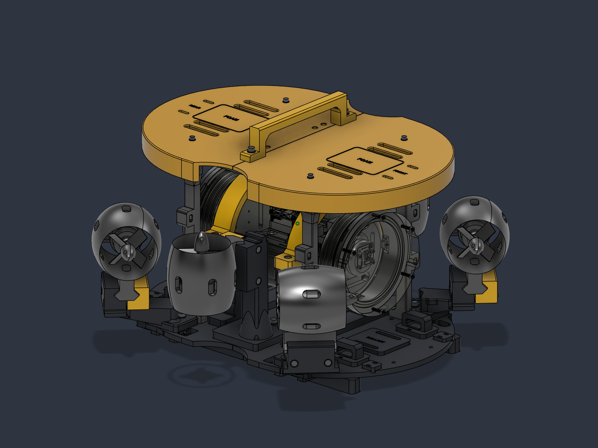

# Club ROV — learning and underwater sensor testing

Project repository: [PrabeshPathak2002/club-rov](https://github.com/PrabeshPathak2002/club-rov).

A six-thruster, tethered remotely operated vehicle for club operations, testing sensors for a RoboSub AUV, training new members, and outreach. The intended operating depth is **20–50 m**, a design target that still requires physical qualification.

## Explore the ROV in 3D

<table>
<tr>
<td width="78%">

</td>
<td align="center" valign="middle">

  
Rotate, pan, and zoom the detailed model.
</td>
</tr>
</table>

[Model scope and attribution](Models/README.md). The assembly STL is for viewing, not printing.

## Purpose

- Evaluate candidate AUV sensors before integrating them into the autonomous vehicle.
- Teach CAD, additive manufacturing, electronics, embedded software, controls, and experimental testing.
- Demonstrate the club's work for promotion and recruitment, while documenting the engineering process as a portfolio project.

## Status

Latest mechanical revision: [all six thrusters reversed, with matching receiver pockets](Documentation/THRUSTER_ORIENTATION.md). The image and 3D model show this revision.

The current mechanical design and print exports are prepared. Physical assembly, electrical integration, companion firmware, and water qualification remain ahead. Existing geometry checks do not establish a depth or structural load rating.

The design uses a modular PETG frame, an existing 4-inch, 200 mm enclosure, and six APISQUEEN U01 thrusters. An ARK FPV running ArduSub is planned for vehicle control; a Waveshare ESP32-P4-WIFI6-POE-ETH will handle camera and Ethernet communications with a USB MAVLink connection to the ARK. Propulsion uses a planned 4S 4000 mAh pack, a DakeFPV four-channel ESC, and two additional ESCs. PoE and a proposed backup battery support the companion electronics. Sensors and several electrical details remain undecided.

## Start here

- [New member learning path](Documentation/NEW_MEMBERS.md)
- [System architecture and open decisions](Documentation/ARCHITECTURE.md)
- [Testing plan](Documentation/TESTING.md) and [test report template](Documentation/templates/TEST_REPORT.md)
- [Roadmap](Documentation/ROADMAP.md)
- [Contributing](CONTRIBUTING.md)
- [Attribution and publishing scope](Documentation/PUBLISHING.md)

## Local design package

GitHub contains documentation and lightweight assembly viewing models. Binary design assets and historical files below remain local pending a distribution and attribution review; their download links will not resolve in this GitHub copy.

- **[Final Design](Final%20Design/README.md)** — current Fusion assembly, STEP, printable files, BOM, assembly guide, validation and previews. Start here.
- **[Archive](Archive/Design%20History%202026-09-29/README.md)** — preserved design history, scripts, logs and earlier revisions.
- **3D models/** — original component/reference downloads, retained in place.
- **Code/** — existing firmware/software files, retained in place.
- **Documentation/** — other project documentation and the organization script.

The earlier structure/S6Hybrid development folder has moved into Archive. Existing chat links to that older location may no longer resolve; use Final Design for the current deliverables. The cleanup preserved all 1,588 original design-history files and verified their SHA-256 hashes after the move.
